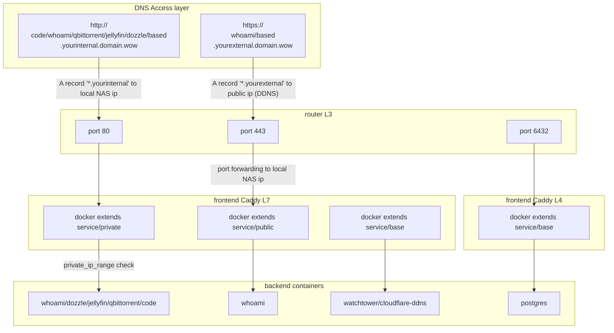

# Synology NAS Bootstrapper ✴

[![CC BY-NC-SA 4.0][cc-by-nc-sa-shield]][cc-by-nc-sa]

Bootstrap your Synology NAS setup with automatic provisioning for: filesystem structure, shares, docker user, docker group, permissions, network, container orchestration and `.env` variables. Just configure the scheduled tasks and the Docker Compose `.env` file with your own dns and folder variables, that's it.

Makes use of the Synology CLI [(pdf)](https://global.download.synology.com/download/Document/Software/DeveloperGuide/Firmware/DSM/All/enu/Synology_DiskStation_Administration_CLI_Guide.pdf), Synology Task Scheduler and [Synology Container Manager](https://www.synology.com/nl-nl/dsm/feature/container-manager).

## Network Design

Following is the partial network design. Refer to the code for full details.

## Prerequisites

A Synology NAS, including:

1. [Container Manager](https://www.synology.com/en-global/releaseNote/ContainerManager) `24.0.2-1525` or higher. Only this version supports Docker Compose `include` statements, introduced in Docker compose [2.20.3](https://docs.docker.com/compose/releases/release-notes/#2203), which this project uses.

1. A compatible [DSM version](https://www.synology.com/nl-nl/releaseNote/DSM), confirmed to work on `7.2.2-72806` (Update 2 and 3).

## Synology configuration

Place the entire project (repo) structure inside of your NAS with path `/volume1/docker/projects` (replace `volume1` with your own volume). You end up with `/volume1/docker/projects/garden`.

Change the filename of [.env.example](garden/.env.example) to `.env` and use your own values.

Remove the `.example` postfix of the files in the [secrets folder](garden/secrets) and use your own values.

### Tasks

The [tasks folder](./garden/tasks/) provides boot scripts. Configure [garden/tasks/main.sh](/garden/tasks/main.sh) as specified the comment of that script. All scripts called by `main.sh` are idempotent and designed for repeated use without damaging an existing setup.

1. [filesystem.sh](./garden/tasks/filesystem.sh) creates the filesystem structure, shares, docker user, docker group and permissions (inspired by [DrFrankenstein](https://drfrankenstein.co.uk/step-2-setting-up-a-restricted-docker-user-and-obtaining-ids/)), also modifies `.env` file variables.

1. [configuredocker.sh](./garden/tasks/configuredocker.sh) fixes the iptables for docker (introduced by [Pedro Lamas](https://gist.github.com/pedrolamas)) and sets the group permissions for docker socket.

1. [freeports.sh](./garden/tasks/freeports.sh) frees port 443 and 80 for own use.

### Containers

The [docker-compose.yaml file](./garden/docker-compose.yaml) configures all containers. Create a project called `garden` in Container Manager based on this file, and fill in the variables in the `.env` file. It does the following:

1. Provisions `watchtower` and `cloudflare-ddns` as internal services without inbound traffic.

1. Configures `caddy` as reverse proxy for all inbound traffic.

1. Provisions `postgres` as a service via port 6432.

1. Provisions `qBittorrent` as a service via port 50777.

1. Provisions `coreDNS` as a service via port 53 (udp and tcp).

1. Provisions the following http/https services:

| public | Uri | Authentication |
| --- | --- | -- |
yes | https://auth.domain.wow | tinyauth itself |
yes | https://whoami.yourexternal.domain.wow | tinyauth |
yes | https://based.yourexternal.domain.wow | [DSM](https://kb.synology.com/en-af/DSM/help/DSM/AdminCenter/system_login_portal_dsm) |
no  | http://based.yourinternal.domain.wow | [DSM](https://kb.synology.com/en-af/DSM/help/DSM/AdminCenter/system_login_portal_dsm) |
no  | http://jellyfin.yourinternal.domain.wow | jellyfin |
no  | http://code.yourinternal.domain.wow | tinyauth |
no  | http://whoami.yourinternal.domain.wow | tinyauth |
no  | http://qbittorrent.yourinternal.domain.wow | tinyauth |
no  | http://dozzle.yourinternal.domain.wow | tinyauth |
no  | http://radarr.yourinternal.domain.wow | tinyauth |
no  | http://bazarr.yourinternal.domain.wow | tinyauth |
no  | http://prowlarr.yourinternal.domain.wow | tinyauth |

If not public, it's;
 - blocking any traffic that doesn't originate `private_ip_range`;
 - only resolvable locally.

## Application configuration

### Jellyfin

Transcoding settings in jellyfin admin dashboard, under <http://jellyfin.yourinternal.domain.wow/web/#/dashboard/playback/transcoding>. Specific for each CPU, assumes you're using a [Gemini Lake Refresh](https://en.wikipedia.org/wiki/Goldmont_Plus#Desktop_processors_(Gemini_Lake_Refresh)) model. Check for `init_hw_device` in logs to confirm it's working.

Hardware acceleration: `Intel QuickSync`

Enable hardware decoding for:

- H264
- HEVC
- MPEG2
- VC1
- VP8
- VP9
- HEVC 10 bit
- VP9 10 bit
- Prefer OS native DXVA or VA-API hardware decoders

Hardware encoding options:

- Enable hardware encoding
- Allow encoding in HEVC format
- Enable VPP Tone mapping
- Enable Tone mapping

### qBittorrent

1. Default username: `admin`, password is printed in container log first time. Go to `Options` - `WebUI` - `Authentication` - check `Bypass authentication for clients in the whitelisted IP subnets` and add `0.0.0.0/0` as value since we use tinyauth instead.

1. Change the listening port to `50777` for incoming connections.

### Radarr

1. Go to `Settings` - `Connections` and configure `Jellyfin` with: 
   - `Host` - `jellyfin`
   - `Port` - `8096`

1. Go to `Settings` - `General` and set `Authentication Required` to `Disabled for Local Addresses` since we use tinyauth instead.

### Prowlarr

1. Go to `Settings` - `Apps` and configure `Radarr` with: 
   - `Prowlarr Server` -  `http://prowlarr:9696`
   - `Radarr Server` - `http://radarr:7878`

1. Go to `Settings` - `General` and set `Authentication Required` to `Disabled for Local Addresses` since we use tinyauth instead.

### Bazarr

1. Go to `Settings` - `Radarr` and configure `Radarr` with:
   - Enabled - `true`
   - Host Address - `radarr`
   - API Key - add from `Radarr` - `Settings` - `General` - `API Key`
1. Go to `Settings` - `Languages` and configure via [bazarr languages guide](https://wiki.bazarr.media/Getting-Started/Setup-Guide/#languages).
1. Go to `settings` - `Providers` and configure via [bazarr providers guide](https://wiki.bazarr.media/Getting-Started/Setup-Guide/#providers) for `OpenSubtitles.com`, `Supersubtitles` and `Gestdown (Addic7ed proxy)`.
1. Set the language profile for existing media, via [bazarr - First Time Installation Configuration](https://wiki.bazarr.media/Getting-Started/First-time-installation-configuration/).

### Postgres

1. Make sure to create an `init.sql` file containing `ALTER ROLE admin SUPERUSER;`, or similar, and place it into `${host_data_config_path}/postgres/scripts`, this folder is mounted in `/docker-entrypoint-initdb.d/` so postgres picks this up.

## License

This work is licensed under a
[Creative Commons Attribution-NonCommercial-ShareAlike 4.0 International License][cc-by-nc-sa].

[![CC BY-NC-SA 4.0][cc-by-nc-sa-image]][cc-by-nc-sa]

[cc-by-nc-sa]: http://creativecommons.org/licenses/by-nc-sa/4.0/
[cc-by-nc-sa-image]: https://licensebuttons.net/l/by-nc-sa/4.0/88x31.png
[cc-by-nc-sa-shield]: https://img.shields.io/badge/License-CC%20BY--NC--SA%204.0-lightgrey.svg
