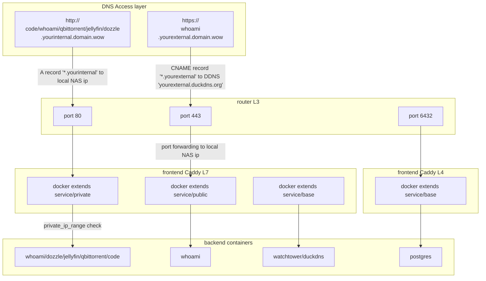

# Synology NAS Bootstrapper ✴

[![CC BY-NC-SA 4.0][cc-by-nc-sa-shield]][cc-by-nc-sa]

Bootstrap your Synology NAS setup with automatic provisioning for: filesystem structure, shares, docker user, docker group, permissions, network and container orchestration and `.env` variables. Just configure the scheduled tasks and the Docker Compose `.env` file with your own dns and folder variables, that's it.

Makes use of the Synology CLI [(pdf)](https://global.download.synology.com/download/Document/Software/DeveloperGuide/Firmware/DSM/All/enu/Synology_DiskStation_Administration_CLI_Guide.pdf), Synology Task Scheduler and [Synology Container Manager](https://www.synology.com/nl-nl/dsm/feature/container-manager).

## Network Design

## Prerequisites

A Synology NAS, including:

1. Container Manager `24.0.2-1525` or higher. At the time of writing, this version is only available by joining the [Beta program](https://www.synology.com/nl-nl/beta/ContainerManager24_0_2). Only this version supports Docker Compose `include` statements, introduced in Docker compose [2.20.3](https://docs.docker.com/compose/releases/release-notes/#2203), which this project uses.

1. A compatible DSM version, confirmed to work on `7.2.2-72806 Update 2`.

## Synology configuration

Place the entire project (repo) structure inside of your NAS with path `/volume1/docker/projects` (replace `volume1` with your own volume). You end up with `/volume1/docker/projects/garden`.

Change the filename of [.env.example](.env.example) to `.env`.

### Tasks

The [tasks folder](./garden/tasks/) provides boot scripts. Configure as specified in the comments of each file. All scripts are idempotent and designed for repeated use without damaging an existing setup.

1. [filesystem.sh](./garden/tasks/filesystem.sh) creates the filesystem structure (inspired by [DrFrankenstein](https://drfrankenstein.co.uk/step-2-setting-up-a-restricted-docker-user-and-obtaining-ids/)).

1. [routedocker.sh](./garden/tasks/routedocker.sh) fixes the iptables for docker (introduced by [Pedro Lamas](https://gist.github.com/pedrolamas)).

1. [freeports.sh](./garden/tasks/freeports.sh) frees port 443 and 80 for own use.

### Containers

The [docker-compose.yaml file](./garden/docker-compose.yaml) configures all containers. Create a project called `garden` in Container Manager based on this file, and fill in the variables in the `.env` file. It does the following:

1. Provisions `watchtower` and `duckdns` as internal services without inbound traffic.

1. Configures `caddy` as reverse proxy for all inbound traffic.

1. Provisions `postgres` as a service via port 6432.

1. Provisions the following services, via http, blocking any traffic that doesn't originate `private_ip_range`:

    - <http://code.yourinternal.domain.wow>
    - <http://whoami.yourinternal.domain.wow>
    - <http://qbittorrent.yourinternal.domain.wow>
    - <http://jellyfin.yourinternal.domain.wow>
    - <http://dozzle.yourinternal.domain.wow>

1. Provisions the following services, via https and public certificate:

    - <https://whoami.yourexternal.domain.wow>

## Application configuration

### Jellyfin

Transcoding settings in jellyfin admin dashboard, under <http://jellyfin.yourinternal.domain.wow/web/#/dashboard/playback/transcoding>. Specific for each CPU, assumes you're using a [Gemini Lake Refresh](https://en.wikipedia.org/wiki/Goldmont_Plus#Desktop_processors_(Gemini_Lake_Refresh)) model. Check for `init_hw_device` in logs to confirm it's working.

Hardware acceleleration: `Intel QuickSync`

Enable hardware decoding for:

- H264
- HEVC
- MPEG2
- VC1
- VP8
- VP9
- HEVC 10 bit
- VP9 10 bit
- Prefer OS native DXVA or VA-API hardware decoders

Hardware encoding options:

- Enable hardware encoding
- Allow encoding in HEVC format
- Enable VPP Tone mapping
- Enable Tone mapping

### qBittorrent

Default username: `admin`, password is printed in container log first time, change it after login.

## License

This work is licensed under a
[Creative Commons Attribution-NonCommercial-ShareAlike 4.0 International License][cc-by-nc-sa].

[![CC BY-NC-SA 4.0][cc-by-nc-sa-image]][cc-by-nc-sa]

[cc-by-nc-sa]: http://creativecommons.org/licenses/by-nc-sa/4.0/
[cc-by-nc-sa-image]: https://licensebuttons.net/l/by-nc-sa/4.0/88x31.png
[cc-by-nc-sa-shield]: https://img.shields.io/badge/License-CC%20BY--NC--SA%204.0-lightgrey.svg
